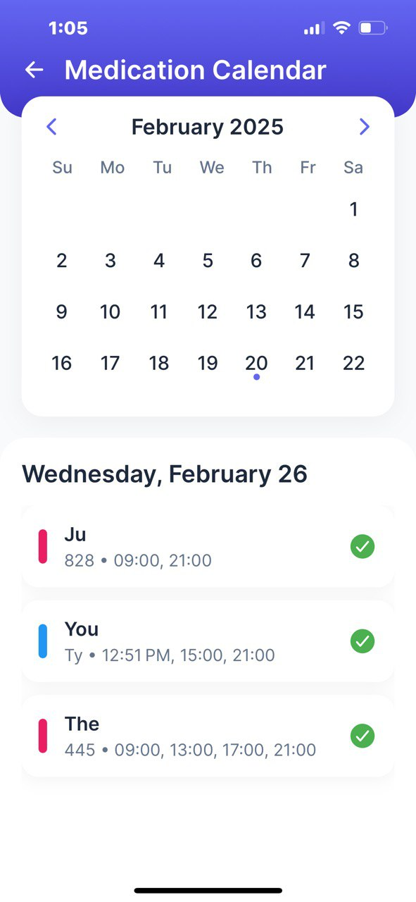
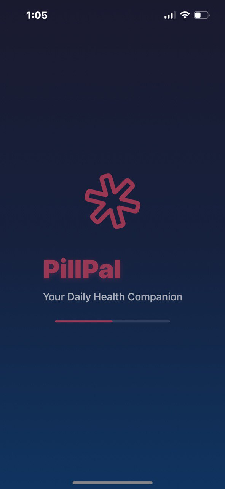
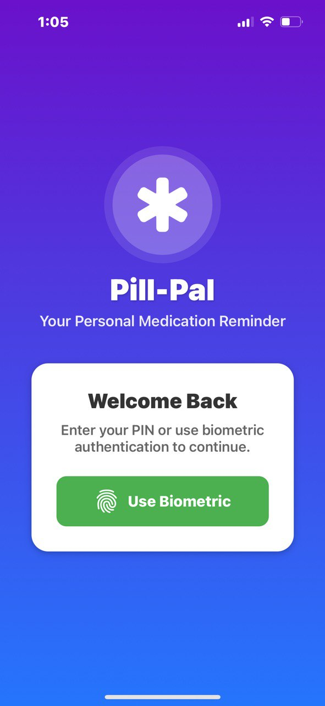
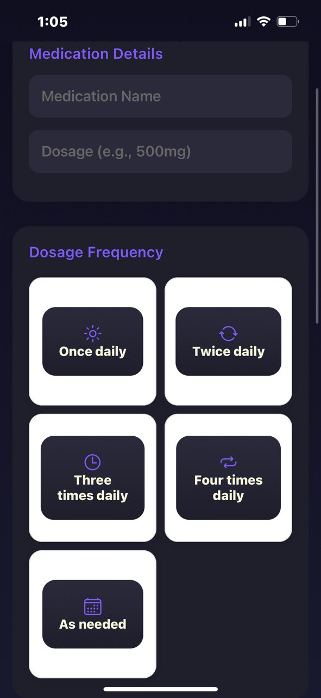

# 🏥 PilPal - Medicine Reminder App

PilPal is a **React Native** app designed to help users manage their medications efficiently. It features local storage, biometric authentication, notifications, a calendar view, and a medicine tracker to ensure users never miss a dose.

---

## 🚀 Features

✅ **Medicine Reminder** – Get timely notifications for your medication schedule.  
✅ **Local Storage** – Store and retrieve medicine data without an internet connection.  
✅ **Biometric Authentication** – Secure your app using fingerprint or face recognition.  
✅ **Calendar View** – Easily visualize your medication schedule in a monthly format.  
✅ **Refill Reminders** – Get alerts when it's time to restock your medications.  
✅ **Medicine Tracker** – Log doses taken and track missed medications.

## Screenshots

### Calendar View

### Onboarding

### Authentication

### Add Medication

### Home

<img src="screenshots/photo_2025

## 🛠️ Tech Stack

- **React Native** – Cross-platform mobile development
- **AsyncStorage** – Local storage for saving user data
- **React Native Push Notifications** – In-app reminders
- **React Native Biometrics** – Secure authentication
- **React Native Calendars** – Medicine schedule visualization

---

🔒 Permissions
To ensure the app functions properly, grant the following permissions:
📌 Notification Access – For reminders
📌 Biometric Access – For secure authentication
